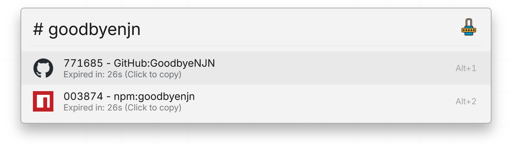

# One-time Password Plugin for Flow Launcher

 

[[中文说明](./README.zh-cn.md)]

This is a [Flow Launcher](https://github.com/Flow-Launcher/Flow.Launcher) plugin for managing and generating time-based one-time passwords (TOTP).

## Install

Run `pm install One-time Password` in Flow Launcher, or download the [latest release](https://github.com/GoodbyeNJN/releases/latest) and extract it to the `%appdata%\FlowLauncher\Plugins` directory.

## Usage

### Setting

The default action keyword is `#`. The added one-time passwords config is displayed below and can be edited, deleted, or added.

### Edit

-   Auth URI: A URI starting with `otpauth://`, used to generate one-time password. Currently only URIs in TOTP format are supported.  
    When configuring 2FA verification, you can use some scanner tools to scan the provided QR code to get the auth URI, and then paste it here.
-   Label: Specify a name for one-time password. It will be parsed from the auth URI by default, and can also be modified by yourself.
-   Icon: Specify an icon to easily distinguish different one-time passwords.
