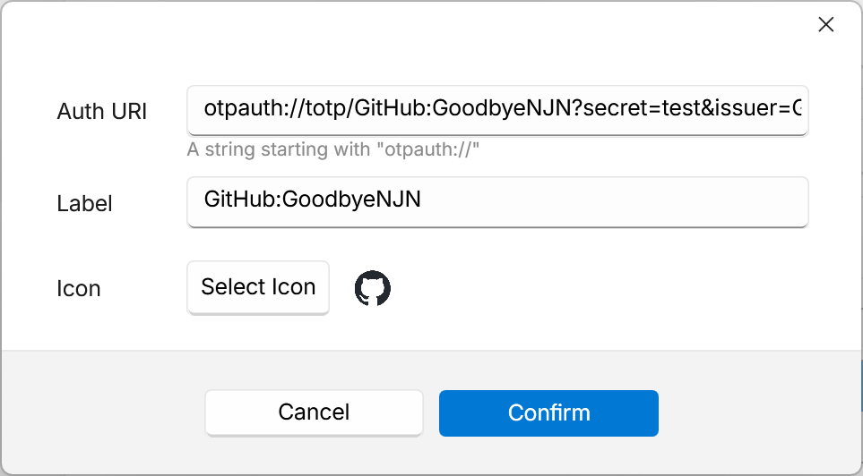

# Flow Launcher 动态密码插件

 

这是一个 [Flow Launcher](https://github.com/Flow-Launcher/Flow.Launcher) 插件，用于管理和生成基于时间的动态密码（TOTP）。

## 安装

在 Flow Launcher 中运行 `pm install One-time Password`，或者直接下载 [最新版本](https://github.com/GoodbyeNJN/releases/latest)并解压到 `%appdata%\FlowLauncher\Plugins` 目录。

## 使用

### 设置

默认的触发关键字是 `#`，已添加的动态密码配置信息显示在下方，可以对其进行编辑、删除、新增操作。

### 编辑

-   认证链接 (Auth URI)：一个以 `otpauth://` 开头的 URI，用于生成动态密码，目前仅支持 TOTP 格式的 URI。 
    在配置两步验证时，可以使用一些扫码工具扫描提供的二维码，获取其中的认证链接，然后将其粘贴到这里。
-   标签 (Label)：指定动态密码的名称，默认会从认证链接中解析得到，也可以自行修改。
-   图标 (Icon)：指定一个图标，方便区分不同的动态密码。
